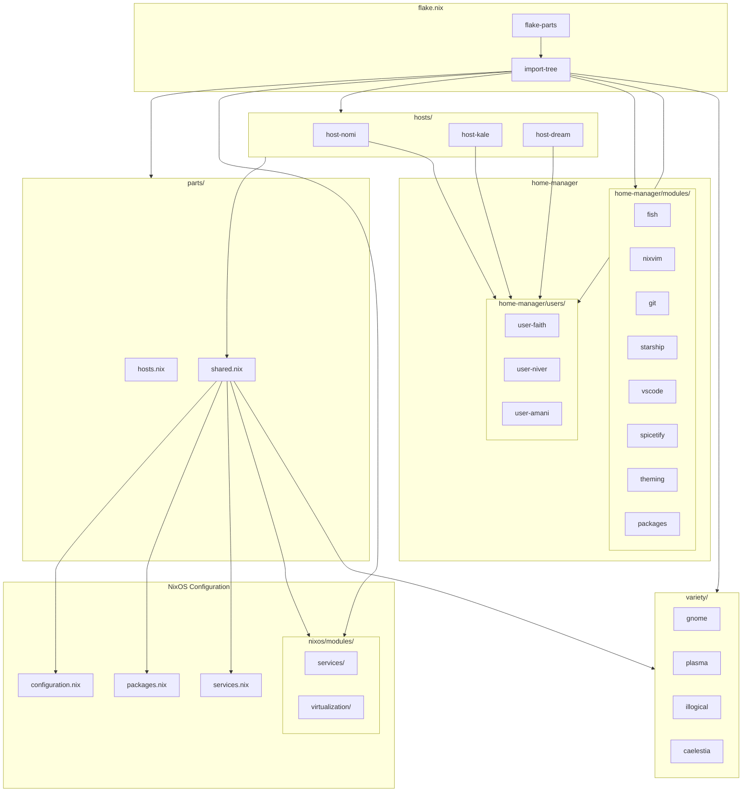
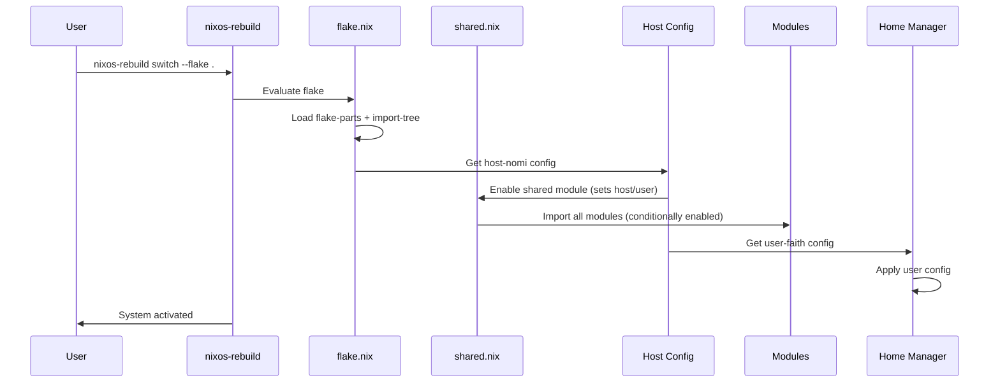

# 🏠 Infrastructure

> **NixOS dotfiles powered by flakes, flake-parts, and home-manager using the shared module pattern**  
> Three machines, for now...

<!-- Badges -->


---

## ⚡ Quick Reference

### Building & Rebuilding

| Command | Description |
|---------|-------------|
| `snrs` | Rebuild current host (defined in fish config) |
| `sudo nixos-rebuild switch --flake .#<host>` | Switch to host config |
| `sudo nixos-rebuild dry-run --flake .#<host>` | Test without switching |
| `nix flake update` | Update all inputs |

### Available Hosts

| Host | User | Desktop Environment | Special Config |
|------|------|---------------------|---------------|
| `nomi` | faith | GNOME | waydroid |
| `kale` | niver | Caelestia (Hyprland) | keyd, libvirt, podman, ydotool |
| `dream` | amani | Caelestia (Hyprland) + Plasma | steam |

### Project Stats
```
34 .nix files  ·  3 NixOS hosts  ·  8 home-manager modules
4 DE configs   ·  4 virtualization modules
```

### File Structure
```
infra/
├── flake.nix              # Flake entry point
├── dotfiles/              # Shared dotfiles (starship, hypr)
├── parts/
│   ├── hosts.nix         # Host configurations
│   └── shared.nix        # Shared module pattern
├── hosts/                 # Host-specific modules
│   ├── nomi/            # faith's machine
│   ├── kale/            # niver's machine
│   └── dream/           # amani's machine
├── nixos/               # System-level modules
│   ├── modules/
│   │   ├── services/    # keyd, nix-flatpak, obs-studio
│   │   └── virtualization/  # waydroid, podman, libvirt, ydotool
│   ├── configuration.nix # Base system config
│   ├── packages.nix     # System packages
│   └── services.nix      # System services
├── home-manager/        # User environment
│   ├── modules/         # Reusable modules (fish, nixvim, etc)
│   └── users/           # Per-user configs
└── variety/             # DE-specific configs (gnome, plasma, illogical, caelestia)
```

---

## 🏗️ Architecture

### Module Hierarchy



### Data Flow



---

## 🖥️ Hosts

### nomi

faith's daily driver — GNOME with Waydroid.

```nix
# Configured via shared module
mySystem.shared = {
  enable = true;
  user = "faith";
  host = "nomi";
};
mySystem.gnome.enable = true;
```

### kale

niver's powerhouse — Caelestia (Hyprland) with full virtualization stack.

```nix
mySystem.shared = {
  enable = true;
  user = "niver";
  host = "kale";
};
mySystem.caelestia.enable = true;
mySystem.keyd.enable = true;
mySystem.podman.enable = true;
mySystem.libvirt.enable = true;
mySystem.ydotool.enable = true;
```

### dream

amani's machine — Caelestia (Hyprland) with Plasma fallback, Steam gaming.

```nix
mySystem.shared = {
  enable = true;
  user = "amani";
  host = "dream";
};
mySystem.caelestia.enable = true;
programs.steam.enable = true;
```

---

## 📦 Modules

### NixOS Modules

#### `nixos/modules/services/`
| Module | Purpose |
|--------|---------|
| `keyd` | Keyboard remapping (disables laptop keyboard) |
| `nix-flatpak` | Flatpak integration via nix-flatpak |
| `obs-studio` | OBS Studio with virtual camera support |

#### `nixos/modules/virtualization/`
| Module | Purpose |
|--------|---------|
| `waydroid` | Android emulation via Waydroid |
| `podman` | Rootless container runtime |
| `libvirt` | VM hypervisor + virt-manager |
| `ydotool` | Input automation for Wayland |

### Home Manager Modules

| Module | Description |
|--------|-------------|
| `fish` | Shell with fish, aliases, snrs command |
| `nixvim` | Neovim config with catppuccin + plugins |
| `git` | Git config with GitHub SSH rewrite |
| `starship` | Rust-powered shell prompt |
| `vscode` | VSCode FHS environment |
| `spicetify` | Spotify theming |
| `theming` | GTK, cursor, icon themes |
| `packages` | Unified package management |

### Variety (DE Configs)

| Module | Desktop | Notes |
|--------|---------|-------|
| `gnome` | GNOME | GDM, extensions, xrdp |
| `plasma` | KDE Plasma 6 | SDDM, kdeconnect |
| `illogical` | Hyprland | SDDM, hyprland + illogical-impulse |
| `caelestia` | Hyprland | SDDM, caelestia dotfiles, hjem |

---

## 🔧 Contributing

### Adding a New Home Manager Module

1. Create the file:
   ```bash
   touch home-manager/modules/my-module.nix
   ```

2. Define the module:
   ```nix
   { ... }: {
     flake.homeModules.my-module = { ... }: {
       # Your config here
     };
   }
   ```

3. Import it in the shared module or a user config:
   ```nix
   # parts/shared.nix or home-manager/users/faith.nix
   imports = [
     self.homeModules.my-module  # Add this
     # ... existing imports
   ];
   ```

### Adding a New NixOS Module

1. Choose the right location:
   ```bash
   # For services
   touch nixos/modules/services/my-service.nix

   # For virtualization
   touch nixos/modules/virtualization/my-virt.nix

   # For DE-specific stuff
   touch variety/my-de.nix
   ```

2. Define the module:
   ```nix
   { ... }: {
     flake.nixosModules.my-module = { ... }: {
       # Your config here
     };
   }
   ```

3. Import it in `parts/shared.nix`:
   ```nix
   imports = [
     self.nixosModules.my-module  # Add this
     # ... existing imports
   ];
   ```

### Adding a New Host

1. Create hardware config:
   ```bash
   touch hosts/myhost-hardware.nix
   ```

2. Create host config:
   ```bash
   touch hosts/myhost.nix
   ```

3. Register in `parts/hosts.nix`:
   ```nix
   myhost = mkHost {
     module = self.nixosModules.host-myhost;
     user = "myuser";
     homeModule = self.homeModules.user-myuser;
   };
   ```

4. Create user config:
   ```bash
   touch home-manager/users/myuser.nix
   ```

### Code Quality

```bash
# Format all .nix files
nix run nixpkgs#alejandra -- --check .  # Check
nix run nixpkgs#alejandra -- --fix .     # Fix

# Find dead code
nix run nixpkgs#deadnix .

# Full check
nix flake check
```

---

## 📖 In-Depth Documentation

<details>
<summary><b>🔮 How flake-parts Works</b></summary>

flake-parts extends Nix flakes with a module system. Instead of manually defining `nixosConfigurations`, you use:

```nix
flake-parts.lib.mkFlake { inherit inputs; } {
  # Automatically creates nixosConfigurations from flake.nixosModules
  # Automatically creates homeConfigurations from flake.homeModules
}
```

Modules export themselves via `flake.nixosModules.<name>` or `flake.homeModules.<name>`, and are auto-discovered by `import-tree`.

</details>

<details>
<summary><b>🌲 How import-tree Works</b></summary>

`import-tree` recursively imports all `.nix` files in a directory. Files with `/_` in the path are ignored (for helpers/private code).

```nix
# This imports ALL .nix files in ./variety/
(inputs.import-tree ./variety)
# └── gnome.nix      → flake.nixosModules.gnome
# └── plasma.nix     → flake.nixosModules.plasma
# └── illogical.nix  → flake.nixosModules.illogical + flake.homeModules.illogical
# └── caelestia.nix  → flake.nixosModules.caelestia + flake.homeModules.caelestia
```

The filename becomes the module name, directory is just for organization.

</details>

<details>
<summary><b>🏠 The Shared Module Pattern</b></summary>

Instead of each host duplicating imports, `parts/shared.nix` defines a **shared module** that all hosts use:

```nix
# In hosts/nomi.nix
imports = [ self.nixosModules.shared ];

mySystem.shared = {
  enable = true;
  user = "faith";
  host = "nomi";
};
mySystem.gnome.enable = true;
```

The shared module conditionally enables modules based on host-specific options. Each host only sets what's different from defaults.

</details>

<details>
<summary><b>🏠 How Home Manager Integration Works</b></summary>

Home Manager is integrated as a NixOS module:

```nix
# In parts/hosts.nix
modules = [
  inputs.home-manager.nixosModules.home-manager  # HM as NixOS module
  self.nixosModules.host-nomi
  ({ ... }: {
    home-manager = {
      useGlobalPkgs = true;
      useUserPackages = true;
      users.faith = self.homeModules.user-faith;
    };
  })
];
```

Users import `self.homeModules.shared` which provides common modules (nixvim, fish, git, etc.), then override per-user options.

</details>

<details>
<summary><b>🔗 Module Dependencies</b></summary>

Modules can reference each other via `self.homeModules.*` or `self.nixosModules.*`:

```nix
# In parts/shared.nix (homeModules.shared)
imports = [
  self.homeModules.nixvim
  self.homeModules.fish
  # ...
];
```

The `mySystem` option namespace is used for system-level toggles:

```nix
# In variety/caelestia.nix
options.mySystem.caelestia.enable = lib.mkEnableOption "caelestia";

# In hosts/dream.nix
mySystem.caelestia.enable = true;
```

</details>

<details>
<summary><b>📦 Virtualization Stack</b></summary>

The virtualization modules are split for composability:

| Module | What it does |
|--------|-------------|
| `waydroid` | Enables Waydroid service |
| `podman` | Enables podman.socket + podman-compose |
| `libvirt` | Starts libvirtd, enables virt-manager |
| `ydotool` | Enables ydotool daemon, sets socket path |

Each can be enabled/disabled independently via `mySystem.virt.<module>.enable`.

</details>

<details>
<summary><b>🎨 Theming System</b></summary>

The `theming` module provides unified GTK/cursor/icon theming:

```nix
# In home-manager/users/faith.nix
myHome.theming = {
  enable = true;
  cursorName = "Bibata-Modern-Amber";
};

# Defined in modules/theming.nix
options.myHome.theming = {
  enable = lib.mkEnableOption "theming";
  cursorName = lib.mkOption { type = lib.types.str; };
};
```

Uses `lib.mkIf config.myHome.theming.enable` to conditionally apply config.

</details>

<details>
<summary><b>🐚 Fish Shell Config</b></summary>

Fish is configured via `home-manager/modules/fish.nix`:

```nix
programs.fish = {
  enable = true;
  shellAliases = {
    nano = "nvim";
    ls = "eza --all --icons ...";
    snrs = "sudo nixos-rebuild switch --flake .#${config.myHome.fish.flakeTarget}";
  };
  interactiveShellInit = ''
    fish_config theme choose ${config.myHome.fish.theme}
  '';
};
```

The `snrs` (sudo nixos rebuild switch) alias is set per-user via `flakeTarget`.

</details>

---

## 🆘 Troubleshooting

<details>
<summary><b>❌ "attribute 'foo' missing"</b></summary>

The module isn't being found. Check:

1. File is in correct location (import-tree recursive)
2. File isn't ignored (`/_` prefix)
3. Module is added to git (`git add`)
4. Module exports correct attr: `flake.homeModules.foo` or `flake.nixosModules.foo`

</details>

<details>
<summary><b>❌ "option does not exist"</b></summary>

Usually means a module isn't imported, or options are defined after they're read. Check that the module defining the option is imported before modules that reference it.

</details>

<details>
<summary><b>❌ Build fails after pulling</b></summary>

```bash
# Clear evaluation cache
rm -rf ~/.cache/nix/eval-cache-*

# Update lock file
nix flake update

# Test dry-run
sudo nixos-rebuild dry-run --flake .#<host>
```

</details>

---

## 🙏 Shoutouts

| Project | Description |
|---------|-------------|
| [flake-parts](https://github.com/hercules-ci/flake-parts) | The module system that makes this all possible |
| [dendritic](https://github.com/mightyiam/dendritic) | The amazing NixOS host pattern (beginners don't use) |

---

## 📜 License

MIT © niversesu
