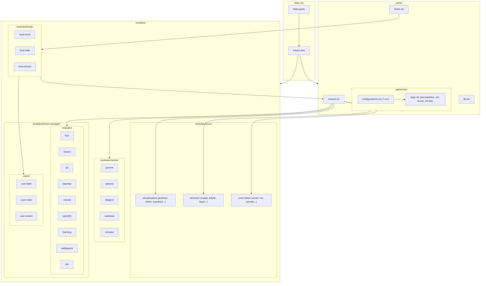
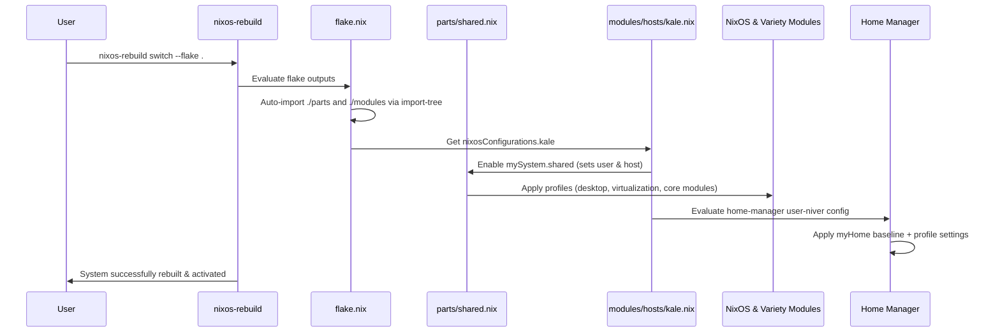

# 🏠 Infrastructure

> **NixOS dotfiles powered by flakes, flake-parts, import-tree, and home-manager using the shared module pattern**  
> Three physical machines, test VMs, and modular desktop profile varieties.

<!-- Badges -->


---

## ⚡ Quick Reference

### Building & Rebuilding

| Command | Description |
|---------|-------------|
| `snrs` | Rebuild current host (defined in fish config via `NH_FLAKE`) |
| `sudo nixos-rebuild switch --flake .#<host>` | Switch to host configuration (`kale`, `nomi`, `dream`) |
| `sudo nixos-rebuild dry-run --flake .#<host>` | Test configuration build without switching |
| `nixos-rebuild build-vm --flake .#<host>-vm` | Build runnable QEMU VM instance of host |
| `nix flake update` | Update all flake inputs |

### Available Hosts

| Host | User | Profiles & Variety | Key Services & Features |
|------|------|--------------------|-------------------------|
| `kale` | `niver` | Desktop + Virtualization + Caelestia | CachyOS Kernel, Jellyfin (`jellyfin.kale`), nixbuild server, Steam, Waydroid |
| `nomi` | `faith` | Desktop (GNOME) | Waydroid, Flatpak, OBS Studio |
| `dream` | `amani` | Desktop + Caelestia | Steam gaming |
| `*-vm` | `niver`/`faith`/`amani` | VM Baseline / Lego modules | QEMU virtual machine test targets (`kale-vm`, `nomi-vm`, `dream-vm`) |

### Project Stats
```
52 .nix files  ·  6 NixOS configurations (3 Hosts + 3 VMs)  ·  10 home-manager modules
5 DE/Shell varieties  ·  8 NixOS services  ·  9 NixOS core modules  ·  4 virtualization modules
```

### File Structure
```
infra/
├── flake.nix              # Flake entry point (imports ./parts & ./modules via import-tree)
├── config/                # Component configuration files (e.g. noctalia.toml)
├── secrets/               # SOPS encrypted secrets and keys
│   ├── secrets.yaml       # Password hashes & nixbuild keys
│   └── key/               # Public SSH keys
├── parts/                 # Flake-parts infrastructure & VM builders
│   ├── hosts.nix          # NixOS host target definitions
│   ├── shared.nix         # Baseline shared NixOS & Home Manager modules & profile options
│   ├── lib.nix            # Flake helper library (mkHost builder)
│   └── vms/               # VM modular building blocks ("Lego" system)
│       ├── lego.nix       # vm-baseline, vm-boost, vm-lite modules
│       └── configurations.nix # VM NixOS target configurations (*-vm)
└── modules/               # Auto-discovered modules (via import-tree)
    ├── hosts/             # Physical host definitions & hardware modules
    │   ├── kale.nix / kale-hardware.nix
    │   ├── nomi.nix / nomi-hardware.nix
    │   └── dream.nix / dream-hardware.nix
    ├── nixos/             # NixOS system-level modules
    │   ├── core/          # boot, hardware, kernel, locale, network, nix, nixbuild, secrets, shell
    │   ├── services/      # caddy, jellyfin, kdeconnect, keyd, nix-flatpak, obs-studio, sddm, xdg-portal
    │   ├── virtualization/# libvirt, podman, waydroid, ydotool
    │   └── packages.nix   # System package collections
    ├── home-manager/      # User environments & Home Manager modules
    │   ├── modules/       # fish, git, nixvim, packages, qol, spicetify, starship, theming, vscode, wallpapers
    │   └── users/         # User configs (niver.nix, faith.nix, amani.nix)
    └── variety/           # Desktop environment & shell varieties
        ├── caelestia.nix  # Caelestia Hyprland desktop shell
        ├── gnome.nix      # GNOME desktop environment
        ├── illogical.nix  # Illogical Impulse Hyprland setup
        ├── noctalia.nix   # Noctalia desktop shell + Astronaut SDDM
        └── plasma.nix     # KDE Plasma 6 desktop
```

---

## 🏗️ Architecture

### Module Hierarchy



### Data Flow



---

## 🖥️ Hosts

### `kale`

niver's daily driver — Caelestia Hyprland shell with CachyOS kernel, virtualization stack, remote nixbuild server, and Jellyfin media server.

```nix
mySystem.shared = {
  enable = true;
  user = "niver";
  host = "kale";
};
mySystem.profiles.desktop.enable = true;
mySystem.profiles.virtualization.enable = true;
mySystem.hardware.gpu = "intel";
mySystem.core.kernel.type = "cachyos";
mySystem.gnome.enable = false;
mySystem.caelestia.enable = true;
mySystem.jellyfin = {
  enable = true;
  domain = "jellyfin.kale";
};
programs.steam.enable = true;
```

### `nomi`

faith's machine — GNOME desktop with flatpak, waydroid, and multimedia tools.

```nix
mySystem.shared = {
  enable = true;
  user = "faith";
  host = "nomi";
};
mySystem.profiles.desktop.enable = true;
mySystem.hardware.gpu = "intel";
```

### `dream`

amani's machine — Caelestia Hyprland desktop with Steam gaming setup.

```nix
mySystem.shared = {
  enable = true;
  user = "amani";
  host = "dream";
};
mySystem.profiles.desktop.enable = true;
mySystem.hardware.gpu = "intel";
mySystem.gnome.enable = false;
mySystem.caelestia.enable = true;
programs.steam.enable = true;
```

---

## 📦 Modules Reference

### NixOS Core Modules (`modules/nixos/core/`)

| Module | Option Namespace | Description |
|--------|------------------|-------------|
| `boot` | `mySystem.core.boot` | GRUB / systemd-boot configuration |
| `kernel` | `mySystem.core.kernel` | Linux kernel configuration (supports standard & CachyOS kernel variants) |
| `nix` | `mySystem.core.nix` | Flakes, garbage collection, binary caches |
| `nixbuild` | `mySystem.core.nixbuild` | Remote build offloading to nixbuild.net |
| `secrets` | `mySystem.core.secrets` | sops-nix secrets management for password hashes and SSH keys |
| `locale` / `network` / `hardware` / `shell` | `mySystem.core.*` | NetworkManager, locale, pipewire audio, default zsh/fish shells |

### NixOS Services (`modules/nixos/services/`)

| Module | Purpose |
|--------|---------|
| `caddy` | Reverse proxy server |
| `jellyfin` | Media server service (`jellyfin.kale`) |
| `kdeconnect` | Cross-device integration daemon |
| `keyd` | Hardware key remapping daemon |
| `nix-flatpak` | Declarative Flatpak package manager |
| `obs-studio` | OBS Studio with virtual camera support |
| `sddm` | SDDM display manager with custom themes |
| `xdg-portal` | Desktop portals for Wayland/Hyprland |

### Virtualization Stack (`modules/nixos/virtualization/`)

| Module | Option | Purpose |
|--------|--------|---------|
| `waydroid` | `mySystem.waydroid.enable` | Android container emulation |
| `podman` | `mySystem.podman.enable` | Rootless container engine & podman-compose |
| `libvirt` | `mySystem.libvirt.enable` | KVM hypervisor & virt-manager |
| `ydotool` | `mySystem.ydotool.enable` | Wayland input automation service |

### Variety / Desktop Environments (`modules/variety/`)

| Module | Desktop / Shell | Features |
|--------|-----------------|----------|
| `caelestia` | Hyprland | Modern Caelestia desktop shell with custom CLI & dotfiles |
| `noctalia` | Hyprland | Noctalia quickshell desktop bar + Astronaut SDDM video theme |
| `gnome` | GNOME 47 | GDM, extensions, RDP support |
| `illogical` | Hyprland | Illogical Impulse Hyprland desktop environment |
| `plasma` | KDE Plasma 6 | SDDM, KDE Connect integration |

### Home Manager Modules (`modules/home-manager/modules/`)

| Module | Description |
|--------|-------------|
| `fish` | Shell aliases (`snrs`), Catppuccin theme integration |
| `nixvim` | Declarative Neovim environment with Catppuccin & language LSP plugins |
| `git` | Git configuration & GitHub SSH URL rewrites |
| `starship` | Prompt theme configuration |
| `vscode` | VSCode editor configuration |
| `spicetify` | Custom Spotify themes and extensions |
| `theming` | GTK, icon themes, Bibata cursors |
| `wallpapers` | Declarative wallpaper distribution |
| `qol` | Quality of Life tools (bat, eza, fzf, ripgrep, zoxide) |
| `packages` | User-level package collections (gaming, tech-tools, creative) |

### Virtual Machine Lego System (`parts/vms/`)

Provides composable VM modules to build and test configurations locally in QEMU:

| Lego Module | Description |
|-------------|-------------|
| `vm-baseline` | Base QEMU virtual machine settings (display acceleration, SSH forwarding on port 2222, default credentials) |
| `vm-boost` | High performance allocation (16GB RAM / 12 Cores) |
| `vm-lite` | Lightweight allocation (4GB RAM / 4 Cores) |

---

## 🔐 Secrets Management

System secrets (such as user password hashes and SSH private keys) are encrypted using **[sops-nix](https://github.com/mic92/sops-nix)** with age keys.

- Secret definition file: `secrets/secrets.yaml`
- Module loading: `modules/nixos/core/secrets.nix`

---

## 🔧 Contributing

### Adding a New Home Manager Module

1. Create the module file in `modules/home-manager/modules/`:
   ```bash
   touch modules/home-manager/modules/my-module.nix
   ```

2. Export the home module:
   ```nix
   { ... }: {
     flake.homeModules.my-module = { ... }: {
       # Your configuration here
     };
   }
   ```

3. Import it in `parts/shared.nix` (`flake.homeModules.shared`):
   ```nix
   imports = [
     self.homeModules.my-module
   ];
   ```

### Adding a New NixOS Service or Core Module

1. Create the module file in `modules/nixos/services/` or `modules/nixos/core/`:
   ```bash
   touch modules/nixos/services/my-service.nix
   ```

2. Export the NixOS module:
   ```nix
   { ... }: {
     flake.nixosModules.my-service = { ... }: {
       # Options and config here
     };
   }
   ```

3. Import it in `parts/shared.nix` (`flake.nixosModules.shared`):
   ```nix
   imports = [
     self.nixosModules.my-service
   ];
   ```

### Adding a New Physical Host

1. Add hardware and host configuration files in `modules/hosts/`:
   ```bash
   touch modules/hosts/myhost-hardware.nix
   touch modules/hosts/myhost.nix
   ```

2. Register the host in `parts/hosts.nix`:
   ```nix
   myhost = self.lib.mkHost {
     module = self.nixosModules.host-myhost;
     user = "myuser";
     homeModule = self.homeModules.user-myuser;
   };
   ```

3. Create the user file in `modules/home-manager/users/myuser.nix`.

### Code Quality & Validation

```bash
# Verify flake evaluation
nix flake show

# Format .nix code
nix run nixpkgs#alejandra -- --check .
nix run nixpkgs#alejandra -- --fix .

# Check for unused code
nix run nixpkgs#deadnix .
```

---

## 📖 In-Depth Architecture Details

<details>
<summary><b>🔮 Automatic Discovery via import-tree</b></summary>

`flake.nix` imports `./parts` and `./modules` using `import-tree`:

```nix
imports = [
  inputs.home-manager.flakeModules.home-manager
  (inputs.import-tree ./parts)
  (inputs.import-tree ./modules)
];
```

`import-tree` recursively imports every `.nix` file inside `./parts` and `./modules`. Each module registers its NixOS and Home Manager components into `flake.nixosModules` or `flake.homeModules`.

</details>

<details>
<summary><b>🏠 System & Home Profiles</b></summary>

Profiles allow coarse-grained feature toggles across machines:

- **`mySystem.profiles.desktop`**: Enables GNOME base, Flatpak support, OBS Studio, and multimedia tools.
- **`mySystem.profiles.virtualization`**: Enables Podman containers, libvirt / KVM, Waydroid, and ydotool.
- **`myHome.profiles.full`**: Enables Spicetify, Starship, VSCode, and Wallpapers.
- **`myHome.profiles.creative`**: Enables video editing & digital art package suite.

</details>

<details>
<summary><b>🧪 QEMU VM Testing</b></summary>

Any host can be built and booted inside a virtual machine without changing physical hardware state:

```bash
# Build & run Kale VM
nixos-rebuild build-vm --flake .#kale-vm
./result/bin/run-kale-vm-vm
```

VM instances use `vm-baseline` which automatically configures default QEMU parameters, OpenGL acceleration, fallback authentication password (`123`), and SSH access on `localhost:2222`.

</details>

---

## 🙏 Shoutouts

| Project | Description |
|---------|-------------|
| [flake-parts](https://github.com/hercules-ci/flake-parts) | The modular framework powering flake output definitions |
| [import-tree](https://github.com/vic/import-tree) | Recursive directory module auto-discovery |
| [home-manager](https://github.com/nix-community/home-manager) | Declarative user environment management |
| [sops-nix](https://github.com/mic92/sops-nix) | Atomic secret management for NixOS |

---

## 📜 License

MIT © [niversesu](https://github.com/niversesu)
