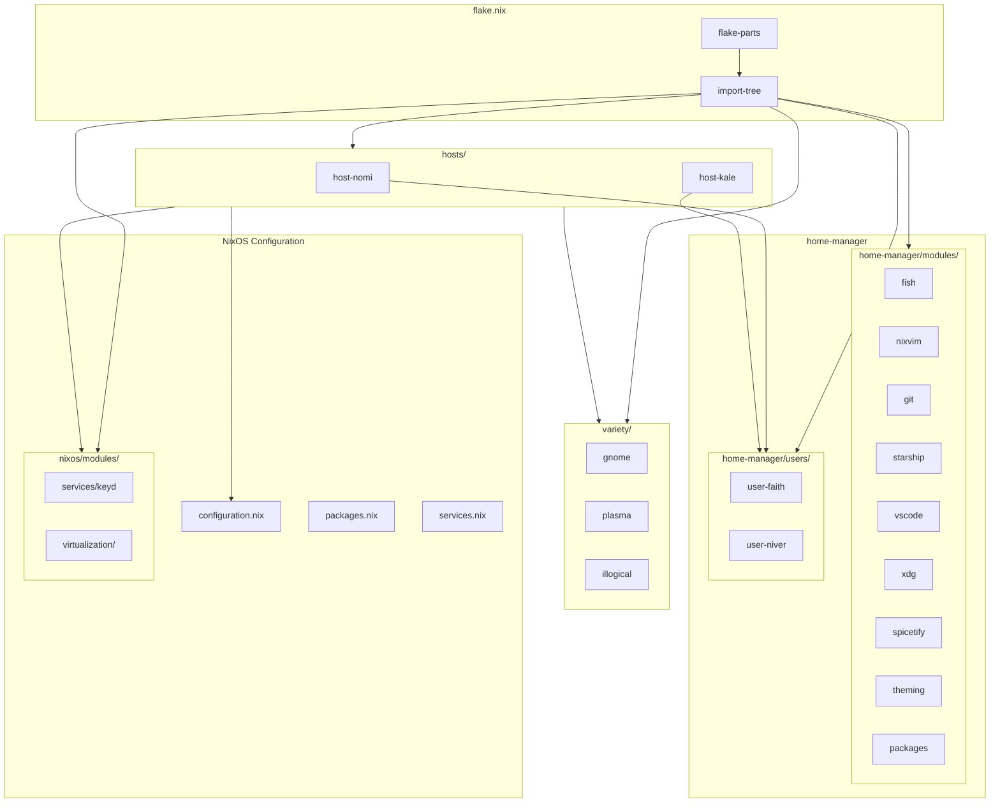
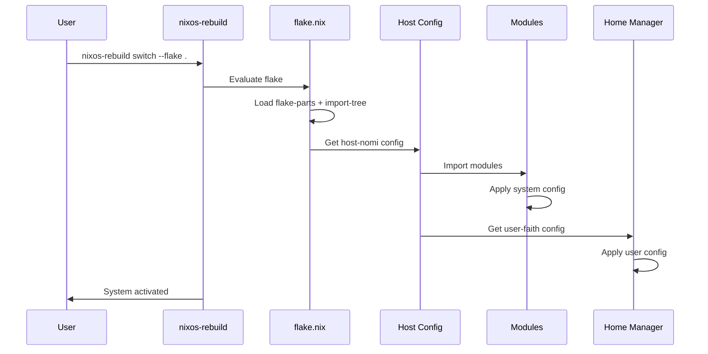

# 🏠 Infrastructure

> **NixOS dotfiles powered by flakes, flake-parts, and home-manager**  
> Two machines, one declarative truth.

<!-- Badges -->


---

## ⚡ Quick Reference

### Building & Rebuilding

| Command | Description |
|---------|-------------|
| `snrs` | Rebuild current host (defined in fish config) |
| `sudo nixos-rebuild switch --flake .#<host>` | Switch to host config |
| `sudo nixos-rebuild dry-run --flake .#<host>` | Test without switching |
| `nix flake update` | Update all inputs |

### Available Hosts

| Host | User | Desktop Environment | Special Config |
|------|------|---------------------|---------------|
| `nomi` | faith | Plasma + GNOME | waydroid |
| `kale` | niver | GNOME | keyd, libvirt, podman, ydotool |

### Project Stats
```
29 .nix files  ·  2 NixOS hosts  ·  9 home-manager modules
3 DE configs   ·  5 virtualization modules
```

### File Structure
```
infra/
├── flake.nix              # Flake entry point
├── parts/hosts.nix        # Host configurations
├── hosts/                 # Host-specific modules
│   ├── nomi/            # faith's machine
│   └── kale/            # niver's machine
├── nixos/               # System-level modules
│   ├── modules/
│   │   ├── services/    # keyd
│   │   └── virtualization/  # waydroid, podman, libvirt, ydotool
│   ├── configuration.nix # Base system config
│   ├── packages.nix     # System packages
│   └── services.nix      # System services
├── home-manager/        # User environment
│   ├── modules/         # Reusable modules (fish, nixvim, etc)
│   └── users/           # Per-user configs
└── variety/             # DE-specific configs (gnome, plasma, illogical)
```

---

## 🏗️ Architecture

### Module Hierarchy



### Data Flow



---

## 🖥️ Hosts

### nomi

faith's daily driver.

```nix
# Imported modules
- host-nomi-hw        # Hardware config
- configuration       # Base system
- illogical           # Hyprland DE
- plasma             # KDE Plasma
- gnome              # GNOME
- virt               # Virtualization base
- waydroid           # Android emulation
```

### kale

niver's powerhouse.

```nix
# Imported modules
- host-kale-hw       # Hardware config
- configuration      # Base system
- gnome              # GNOME
- keyd               # Keyboard remapping
- virt               # Virtualization base
- podman             # Container runtime
- libvirt            # VM management
- ydotool            # Input automation
- waydroid           # Android emulation
```

---

## 📦 Modules

### NixOS Modules

#### `nixos/modules/services/`
| Module | Purpose |
|--------|---------|
| `keyd` | Keyboard remapping (disables laptop keyboard) |

#### `nixos/modules/virtualization/`
| Module | Purpose |
|--------|---------|
| `virt` | Base options + disables nftables |
| `waydroid` | Android emulation via Waydroid |
| `podman` | Rootless container runtime |
| `libvirt` | VM hypervisor + virt-manager |
| `ydotool` | Input automation for Wayland |

### Home Manager Modules

| Module | Description |
|--------|-------------|
| `fish` | Shell with fish, aliases, snrs command |
| `nixvim` | Neovim config with catppuccin + plugins |
| `git` | Git config with GitHub SSH rewrite |
| `starship` | Rust-powered shell prompt |
| `vscode` | VSCode FHS environment |
| `xdg` | XDG defaults + Chrome as default browser |
| `spicetify` | Spotify theming |
| `theming` | GTK, cursor, icon themes |
| `packages` | Unified package management |
| `illogical` | illogical-impulse dotfiles integration |

### Variety (DE Configs)

| Module | Desktop | Notes |
|--------|---------|-------|
| `gnome` | GNOME | GDM, extensions, xrdp |
| `plasma` | KDE Plasma 6 | SDDM, kdeconnect |
| `illogical` | Hyprland | SDDM, hyprland + illogical-impulse |

---

## 🔧 Contributing

### Adding a New Home Manager Module

1. Create the file:
   ```bash
   touch home-manager/modules/my-module.nix
   ```

2. Define the module:
   ```nix
   { ... }: {
     flake.homeModules.my-module = { ... }: {
       # Your config here
     };
   }
   ```

3. Import it in a user config:
   ```nix
   # home-manager/users/faith.nix
   imports = [
     self.homeModules.my-module  # Add this
     # ... existing imports
   ];
   ```

### Adding a New NixOS Module

1. Choose the right location:
   ```bash
   # For services
   touch nixos/modules/services/my-service.nix

   # For virtualization
   touch nixos/modules/virtualization/my-virt.nix

   # For DE-specific stuff
   touch variety/my-de.nix
   ```

2. Define the module:
   ```nix
   { ... }: {
     flake.nixosModules.my-module = { ... }: {
       # Your config here
     };
   }
   ```

3. Import it in a host:
   ```nix
   # hosts/nomi.nix or hosts/kale.nix
   imports = [
     self.nixosModules.my-module  # Add this
     # ... existing imports
   ];
   ```

### Adding a New Host

1. Create hardware config:
   ```bash
   touch hosts/myhost-hardware.nix
   ```

2. Create host config:
   ```bash
   touch hosts/myhost.nix
   ```

3. Register in `parts/hosts.nix`:
   ```nix
   myhost = inputs.nixpkgs.lib.nixosSystem {
     system = "x86_64-linux";
     specialArgs = { inherit inputs self; };
     modules = [
       inputs.home-manager.nixosModules.home-manager
       self.nixosModules.host-myhost
       ({ ... }: {
         home-manager = {
           useGlobalPkgs = true;
           useUserPackages = true;
           extraSpecialArgs = { inherit inputs self; };
           users.myuser = self.homeModules.user-myuser;
         };
       })
     ];
   };
   ```

4. Create user config:
   ```bash
   touch home-manager/users/myuser.nix
   ```

### Code Quality

```bash
# Format all .nix files
nix run nixpkgs#alejandra -- --check .  # Check
nix run nixpkgs#alejandra -- --fix .     # Fix

# Find dead code
nix run nixpkgs#deadnix .

# Full check
nix flake check
```

---

## 📖 In-Depth Documentation

<details>
<summary><b>🔮 How flake-parts Works</b></summary>

flake-parts extends Nix flakes with a module system. Instead of manually defining `nixosConfigurations`, you use:

```nix
flake-parts.lib.mkFlake { inherit inputs; } {
  # Automatically creates nixosConfigurations from flake.nixosModules
  # Automatically creates homeConfigurations from flake.homeModules
}
```

Modules export themselves via `flake.nixosModules.<name>` or `flake.homeModules.<name>`, and are auto-discovered by `import-tree`.

</details>

<details>
<summary><b>🌲 How import-tree Works</b></summary>

`import-tree` recursively imports all `.nix` files in a directory. Files with `/_` in the path are ignored (for helpers/private code).

```nix
# This imports ALL .nix files in ./variety/
(inputs.import-tree ./variety)
# └── gnome.nix      → flake.nixosModules.gnome
# └── plasma.nix     → flake.nixosModules.plasma
# └── illogical.nix  → flake.nixosModules.illogical + flake.homeModules.illogical
```

The filename becomes the module name, directory is just for organization.

</details>

<details>
<summary><b>🏠 How Home Manager Integration Works</b></summary>

Home Manager is integrated as a NixOS module:

```nix
# In parts/hosts.nix
modules = [
  inputs.home-manager.nixosModules.home-manager  # HM as NixOS module
  self.nixosModules.host-nomi
  ({ ... }: {
    home-manager = {
      useGlobalPkgs = true;
      useUserPackages = true;
      users.faith = self.homeModules.user-faith;  # User config
    };
  })
];
```

Users are defined in `home-manager.users.<username>`, and each user imports from `self.homeModules.*`.

</details>

<details>
<summary><b>🔗 Module Dependencies</b></summary>

Modules can reference each other via `self.homeModules.*` or `self.nixosModules.*`:

```nix
# In home-manager/users/faith.nix
imports = [
  self.homeModules.nixvim   # References the nixvim module
  self.homeModules.fish
  # ...
];
```

The `mySystem` option namespace is used for system-level toggles:

```nix
# In variety/illogical.nix
options.mySystem.illogical.enable = lib.mkEnableOption "illogical impulse";

# In hosts/nomi.nix
mySystem.illogical.enable = true;  # Enable it
```

</details>

<details>
<summary><b>📦 Virtualization Stack</b></summary>

The virtualization modules are split for composability:

| Module | What it does |
|--------|-------------|
| `virt` | Defines options, disables nftables (required for libvirt) |
| `podman` | Enables podman.socket + podman-compose |
| `libvirt` | Starts libvirtd, enables virt-manager |
| `ydotool` | Enables ydotool daemon, sets socket path |
| `waydroid` | Enables Waydroid service |

Each can be enabled/disabled independently via `mySystem.virt.<module>.enable`.

</details>

<details>
<summary><b>🎨 Theming System</b></summary>

The `theming` module provides unified GTK/cursor/icon theming:

```nix
# In home-manager/users/faith.nix
myHome.theming = {
  enable = true;
  cursorName = "Bibata-Modern-Amber";
};

# Defined in modules/theming.nix
options.myHome.theming = {
  enable = lib.mkEnableOption "theming";
  cursorName = lib.mkOption { type = lib.types.str; };
};
```

Uses `lib.mkIf config.myHome.theming.enable` to conditionally apply config.

</details>

<details>
<summary><b>🐚 Fish Shell Config</b></summary>

Fish is configured via `home-manager/modules/fish.nix`:

```nix
programs.fish = {
  enable = true;
  shellAliases = {
    nano = "nvim";
    ls = "eza --all --icons ...";
    snrs = "sudo nixos-rebuild switch --flake .#${config.myHome.fish.flakeTarget}";
  };
  interactiveShellInit = ''
    fish_config theme choose ${config.myHome.fish.theme}
  '';
};
```

The `snrs` (sudo nixos rebuild switch) alias is set per-user via `flakeTarget`.

</details>

---

## 🆘 Troubleshooting

<details>
<summary><b>❌ "attribute 'foo' missing"</b></summary>

The module isn't being found. Check:

1. File is in correct location (import-tree recursive)
2. File isn't ignored (`/_` prefix)
3. Module is added to git (`git add`)
4. Module exports correct attr: `flake.homeModules.foo` or `flake.nixosModules.foo`

</details>

<details>
<summary><b>❌ "option does not exist"</b></summary>

Usually means a module isn't imported, or options are defined after they're read. Check that the module defining the option is imported before modules that reference it.

</details>

<details>
<summary><b>❌ Build fails after pulling</b></summary>

```bash
# Clear evaluation cache
rm -rf ~/.cache/nix/eval-cache-*

# Update lock file
nix flake update

# Test dry-run
sudo nixos-rebuild dry-run --flake .#<host>
```

</details>

---

## 📜 License

MIT © niversesu
